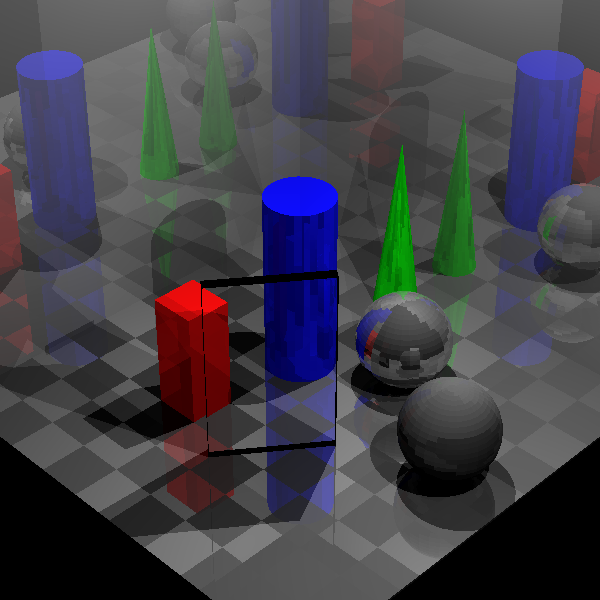
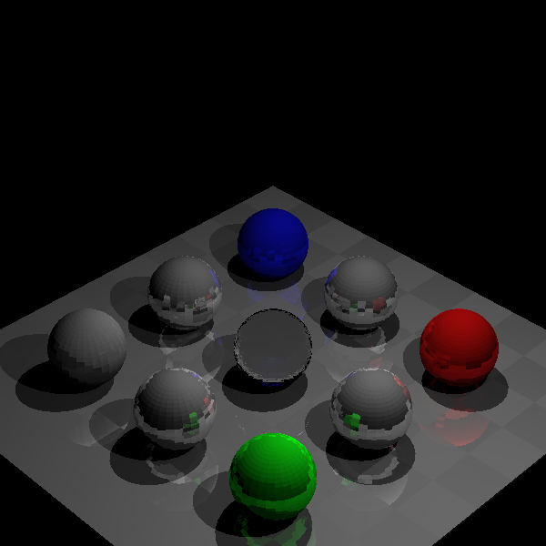
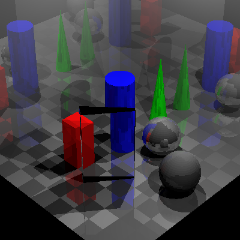

# naivert

naivert is an implementation of ray tracing algorithm using Phone illumination model.  
For geometry calculation, naivert uses the library of [Geometry3D](https://github.com/GouMinghao/Geometry3D).  
You may refer to the examples and documentation of Geometry3D to get to know how to use naivert.

## Requirements

numpy, Geometry3D, matplotlib and opencv-python

## Installation

```bash
pip install naivert
```

## Examples
Run .py files under examples folder.  
For example:
```bash
python example3.py
```


```bash
python example4.py
```


```bash
python example5.py
```


Note that the calculation may be very slow. You can modify the resolution of the image to reduce the time cost.
